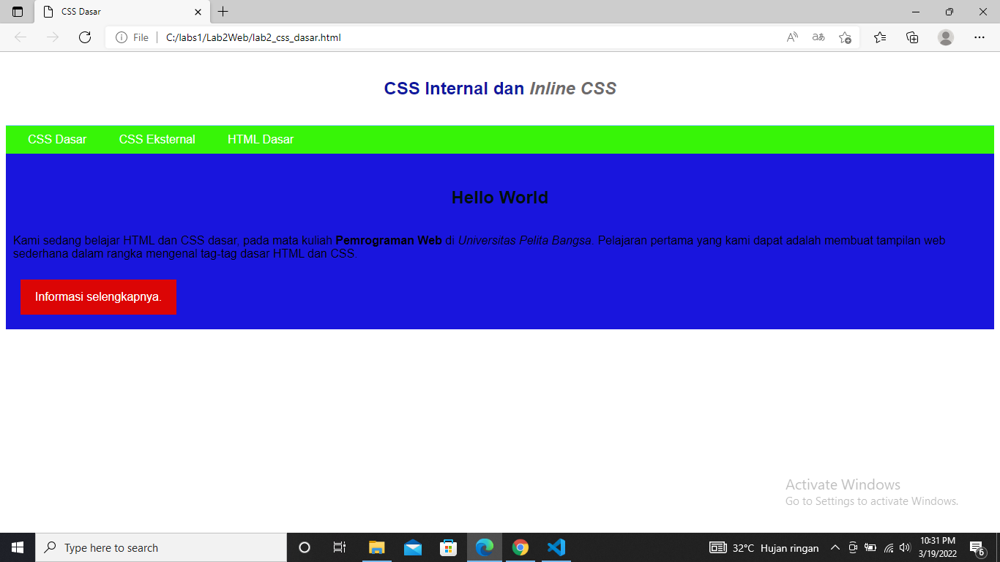

# Pratikum Pemrograman Web 

Pratikum ini dibuat untuk memenuhi tugas pertemuan ke 3

Nama  : Mulifatkhul Rachiim

NIM   : 312010180

Kelas : TI.20.B1

# Langkah - Langkah Pratikum

1. Buatlah dokumen HTML

2. selanjutnya buka di browser untuk melihat hasilnya

3. _Membuat CSS Internal_ selanjutnya simpan kembali kemudian di refresh ulang untuk melihat hasilnya

4. _Membuat CSS Eksternal buat file mengunakan nama_ Style_eksternal.css kemudian buat deklarasi seperti berikut

kemudian tambahkan tag <_link_> untuk melihat penambahan CSS yang ada pada bagian <_head_>

5. menambahkan _CSS Selector_ menggunakan ID dan Class Selector. pada file style_eksternal.css

kemudian simpan kembali setelah itu di refresh pada laman untuk melihat hasilnya

# Pertanyaan dan Jawaban Tugas

1. Lakukan eksperimen dengan mengubah dan menambah properti dan nilai pada kode CSS dengan mengacu pada CSS Cheat Sheet 

yang diberikan pada file terpisah dari modul ini.

Jawaban :

2. Apa perbedaan pendeklarasian CSS elemen h1 {...} dengan #intro h1 {...}? berikan penjelasannya!

jawaban

perbedaaannya jika hanya h1{} maka akan merubah semua yang ada didalam elemen h1 sedangkan intro h1 hanya akan merubah yang memiliki tag intro

3. Apabila ada deklarasi CSS secara internal, lalu ditambahkan CSS eksternal dan inline CSS pada elemen yang sama. Deklarasi manakah yang akan ditampilkan pada browser? Berikan penjelasan dan contohnya!

jika ketiga CSS merubah elemen yang sama maka deklarasi tersebut akan mengikuti aturan prioritas dimana prioritas CSS nya seperti ini:

disini bisa dilihat sudah terdapat 2 css mencoba merubah warna text h1 :

4. Pada sebuah elemen HTML terdapat ID dan Class, apabila masing-masing selector tersebut terdapat deklarasi CSS, maka deklarasi manakah yang akan ditampilkan pada browser? Berikan penjelasan dan contohnya! (
)

Jawaban:

Sekian dari saya, Terimakasih :)

